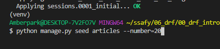
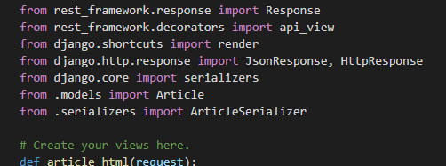
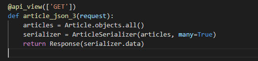
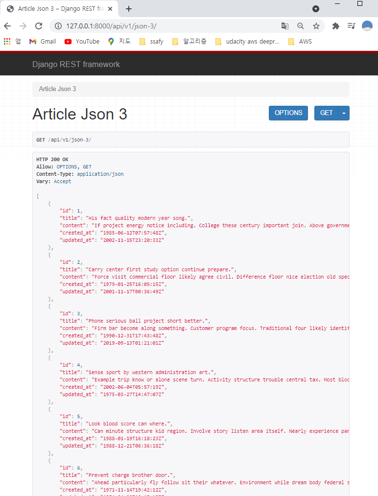
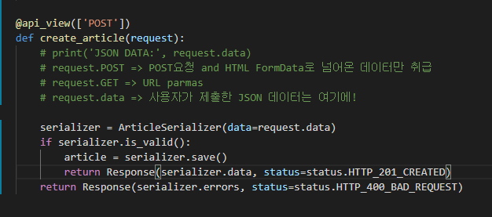
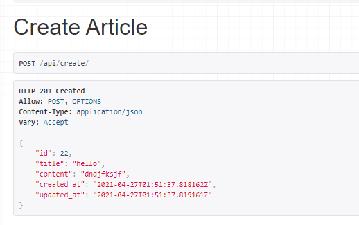
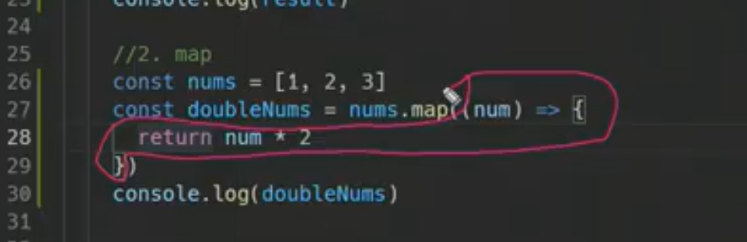
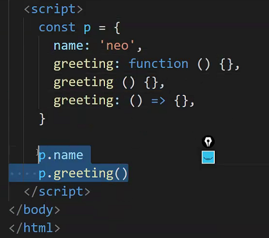
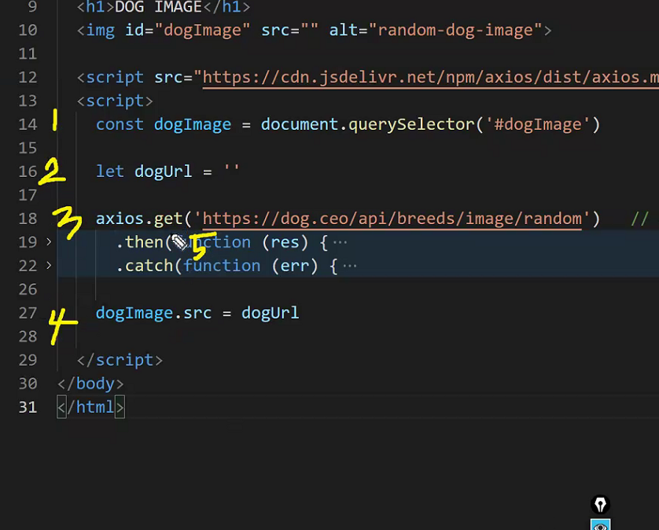

# Django 끝자락

## REST API

- 모든 URL 은 URI 이다 -> true

- 모든 URI는 URL이다 -> False

- URI 설계시 주의사항
  - _ 아닌 -(하이폰) 사용 -> 가독성
  - 소문자 사용 -> 대소문자에 따라 다른 자원으로 인식하게 됨
  - 파일 확장자는 포함 x
  
- HTTP Method 종류
  - GET - 특정 자원의 표시 요청, 오직 데이터를 받기만 함
  - POST - 서버로 데이터를 전송, 서버에 변경사항을 만듦
  - PUT - 요청한 주소의 자원을 수정
  - DELETE - 지정한 자원을 삭제

- `GET/articles/1/read/` (x), URI에 불필요한 정보(행위표현)가 포함 -> `GET/articles/1/` (o) 

- `GET/articles/1/delete/` (x),  URI는 자원에 대한 행위는 HTTP method로 표현 -> `DELETE/articles/1/` (o)

  

### 실습

- django-seed 로 더미데이터 만들기
  - pip install django-seed 하고 , settings에 installed app 에 추가하고 , 20 개 넣겠다 -> 아래처럼.
  - 

- rest_framwork 하면
- 

- 아래처럼 json이 템플릿 형태로 나옴
- 

- create
  - 위에 `from rest_framework import status`하고 
  
  - 
  
  - 하면
  
  - 
  
    이런식으로 나옴

### POSTMAN

# Js

- 
- preventDefault()
  - 현재 이벤트의 기본 동작을 중단
  - 태그의 기본 동작(a 태그는 클릭 시 페이지 이동, form 태그는 폼 데이터를 전송)
  - 이벤트의 전파를 막지 않고 이벤트의 기본 동작만 중단
- 비어있는 배열은 True
  - if ([]) {console.log('hi')} => True

### 심화시작.0503

- blocking 과 non-blocking 의 차이

- call back 함수
- 	 

- greeting 3개 다 같은말
- 

- dogImage.src가 axios 밖으로 나오면 사진 안나옴. 실행 순서가 달라져서. 

- 

