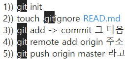

# git 사용하기

*2021.01.26*

1. 일단 가장 기본적으로 git에 push 할 때 , push 할 폴더에서 git bash 열어서

```
$ git add .
$ git commit -m '쓰고싶은말'
$ git push origin master
```

2. 조금 더 깊이 들어가서

```
$ git branch branch-name => 새로운 branch 생성
$ git switch(or checkout) branch-name => 전환
$ git switch -c branch-name => 새로운 branch 생성과 함께 전환
$ git branch -d branch-name => branch delete
$ git branch -D branch-name => 강제로 delete
$ git merge branch-name => branch 병합. ex)master과 home-page를 같은것으로 만들겠다.
```

3. 

```
$ git remote add github https://github.com/AmberPark/learn_git.git => github으로 푸쉬할때
$ git push github master
```


## git 리포 만들때

1.  `$ touch .gitignore`만들기
2.  `$ git init`
3.  `$ touch .gitignore READ.md`
4.  `$ git add .` -> `$ git commit` 그 다음에
5.  `$ git remote add origin 주소`
6.  ` $ git push origin master` 



## 받아올때

두번째 페어는 


1. `$ touch .gitignore`만들기 , vs code 들어가기

2. `$ git init`

3. python -m venv venv

4. source venv/Scripts/activete

5. pip install django django_extensions

6. pip freeze > requirements.txt (페어는 pip install -r requirements.txt 로 받아옴)

7. (`$ touch .gitignore READ.md` => 얘 1번에서 같이하기)

   

8. `$ git remote add origin 주소`(클론 눌러서 주소 복사한거)

9. git remote -v

10. `$ git add .` -> `$ git commit -m message` 

11. ` $ git push origin master` 


# git undo

- add 되돌리는거 => rm, 수정된 파일을 돌리는거는 restore
- commit 메세지 되돌리는거 => `git commit --ammend` => 다채로운 색깔의 vim 뜸 => `i` 누름(입력모드) => 끼워넣기 모드 됨 => 메세지 지우고 esc 눌러서 끼워넣기 모드 취소 => `:wq` 입력 하고 엔터. => git log로 확인. ( open vim, vim adventure 등의 사이트로 vim 연습할 수 잇음)

- 파일 하나 빠뜨리고 커밋 했을때도  `git commit --ammend`  => 커밋 파일 합쳐짐 => `:wq` 입력 하고 엔터.
- git log 간략하게 보려면 `git log --oneline`
- 과거로 돌아가고싶달 -> `git reset -- hard <가고자 하는 로그>` => 완전히 과거로 돌어가는거.(코드도 바뀜)
- `git reset --soft <가고자 하는 로그>` => 커밋의 시점은 과거로. add한 기록은 남겨두고.
- `git reset <가고자하는 로그>`(default 값이 --mixed) => add 전단계까지 남아있음. 