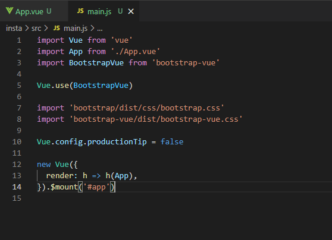

# :stuck_out_tongue_winking_eye:Instagram clone coding

## :black_nib:setup

- `vue start insta`
- `npm install vue-router`
- `npm install bootstrap-vue bootstrap`

- 
  - main.js 에 부트스트랩 import(https://bootstrap-vue.org/docs)

## :black_nib: