- POST method 를 쓰면 views 에서 `if request.method == 'POST':` 쓰고 GET을 다 POST로 바꿔주기 

- 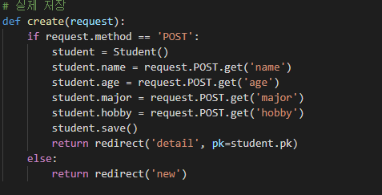

  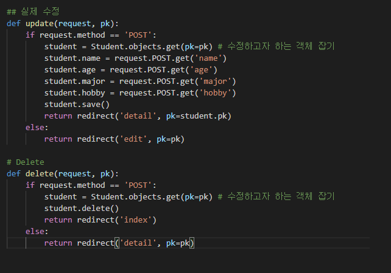

- html에서 form 안에 `method='POST'` 하고 밑에 `` 꼭 적기! 안그러면 forbidden 페이지 뜸. 

- 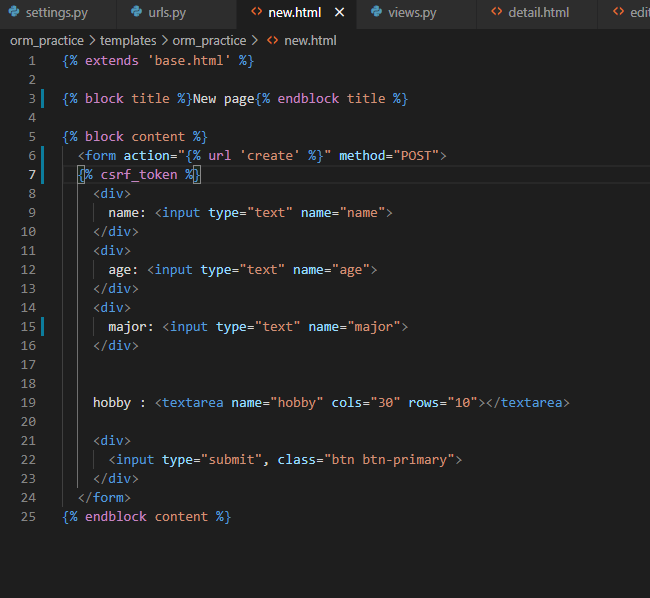

  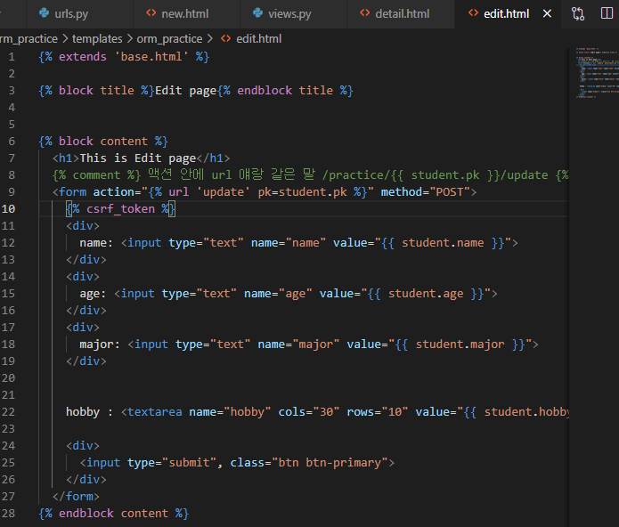

  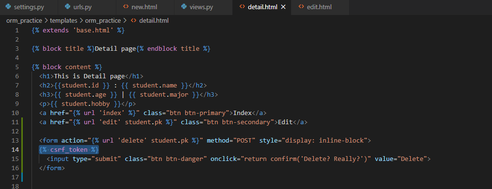

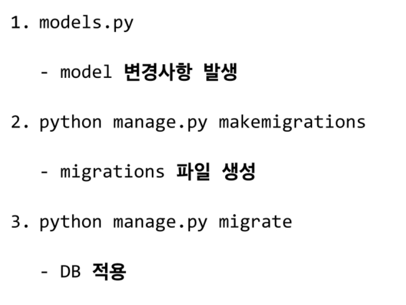

# CREAT

- creat 하는 세가지 방법. (shell_plus 터미널에서)

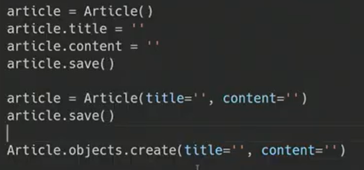

# READ

## 1. all()

## 2. get()

- 객체가 없으면 DoesNotExist 에러 발생
- 객체가 여러개면 MultipleObjectsReturned 에러 발생
- 위와 같은 특징을 갖고 있기 때문에 unique 혹은 NOT NULL 특징을 가지고 있는 경우에만 사용 가능( pk)

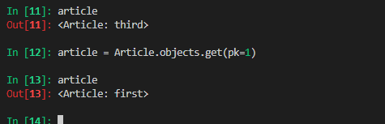

## 3. filter()

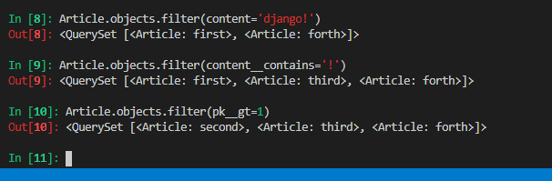

# DELETE

shell_plus 에서 .delete() 하고 s = 0

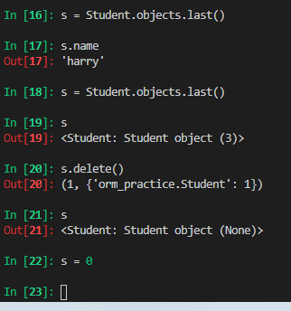

- 브라우저에서 delete 누르고 확인 창 뜨게하는거 : onclick="return confirm('message')"

# admin

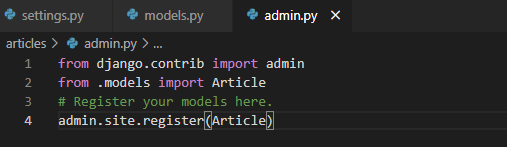

- admin 에 만든 클래스 넣고(어드민 사이트에 내가만든 클래스 register) superuser하면 어드민 사이트에서 데이터 수정 쉽게 가능.
- 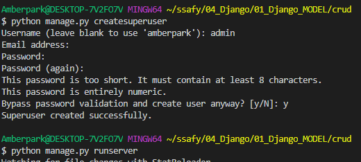

- 어드민 사이트 에서 보일 디스플레이 설정

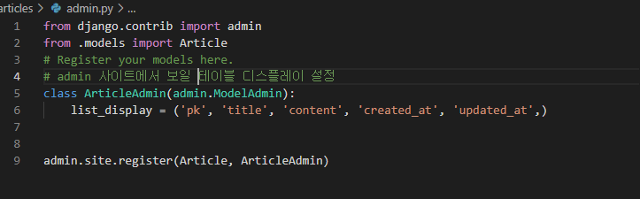

# 데이터 다 날리고 처음부터 하고싶을 때

- db 날리고, migrations 안에 생긴 initial.py들도 지워주기.
- 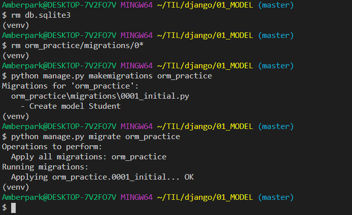

- 다시 처음부터 makemigrations, migrate 하기