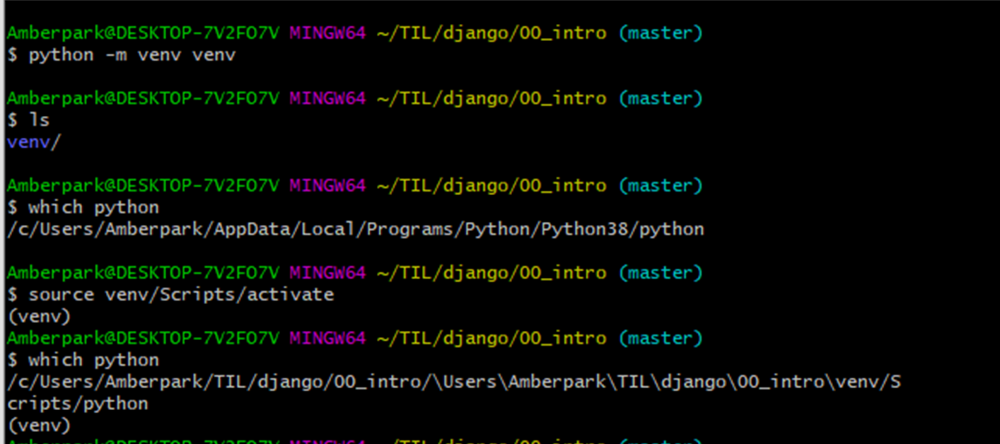
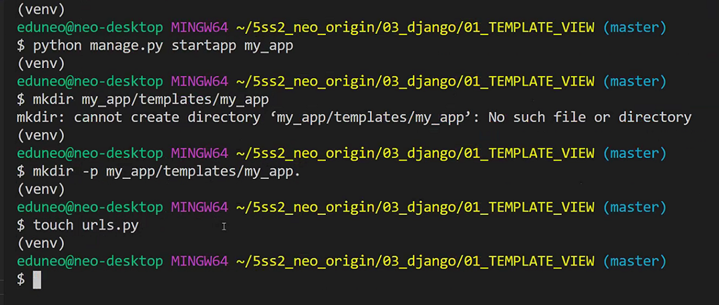
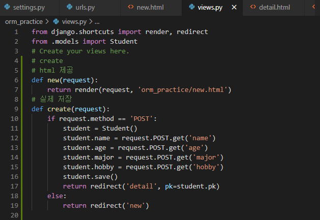
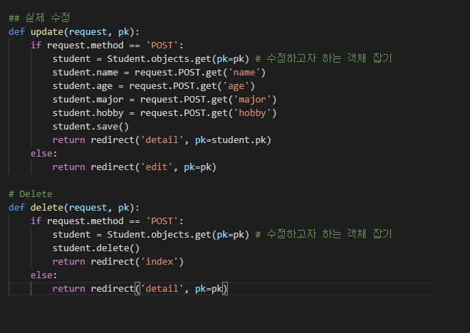
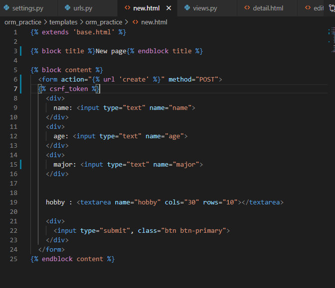
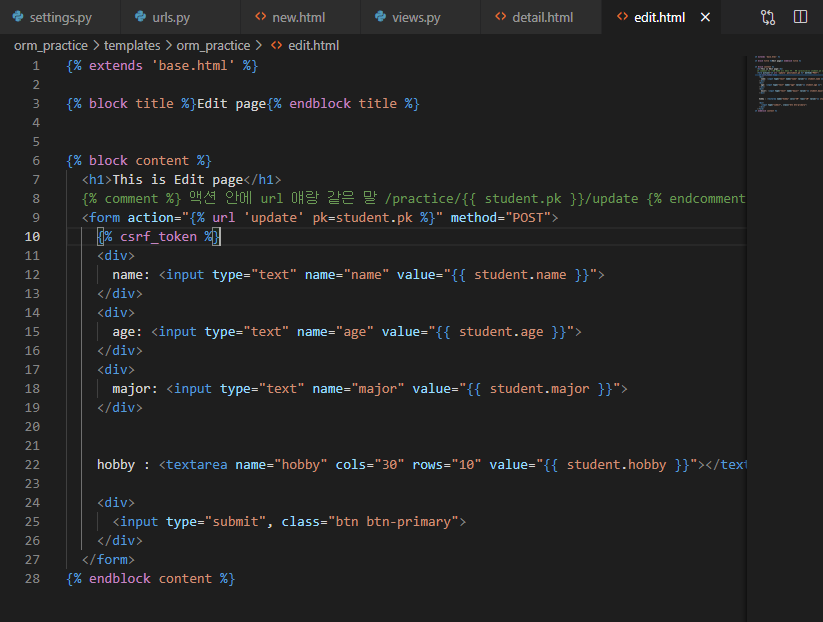
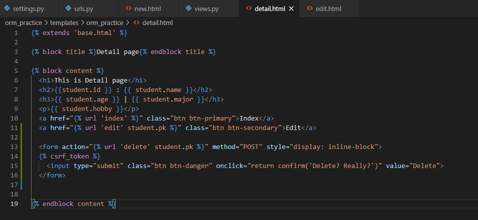

# 가상환경 파이썬 만들기

- 먼저 폴더 만들고 거기서 

- `python -m venv venv`

- `ls`로 확인하고 `which python`으로 다시 확인

- `source venv/Scripts/activate` 로 활성화 (or VS code 로 열기)

- 이제 (venv)라고 뜸

- deactivate 하면 venv 없어짐

  예시

  

- 설치할 것들에 내용 자동으로 설치하는 것은 `pip install -r requirements.txt`

# django 프로젝트 만드는 순서

1. 빈폴더(프로젝트 루트)를 만든다
   1. `.gitignore` 생성
   2. `$ git init` 으로 리포 초기화
   3. `README.md` 생성
   4. 원격 저장소 생성 후 연결
   5. add => commit => push
2. 해당폴더로 이동해서 `$ python -m venv venv` 명령어를 통해 가상독립환경 폴더를 만든다.
3. 가상 동립환경을 활성화`$ source venv/Scripts/activate`한다.
4. `$ pip install django` 를 통해 필요한 패키지들을 설치한다
5. `$ django-admin startproject (프로젝트이름)` 명령어를 통해 프로젝트 초기화
6. 그 안으로 들어가서 vs 코드 열고 프로젝트 진행

## 프로젝트 열기

반드시 프로젝트 루트 폴더는 대문자로!

## 프로젝트 독립환경 설저

1. `ctrl` + `shift` + `p`

2. python: select interpreter 치고 
3. venv/ 안의 파이썬 선택. 못잡으면
4. enter interpreter path => find => venv/scripts/python 선택
5. 완료 이후 왼쪽 하단에 python venv 확인
6. 터미널창 켜면 (venv) 자동으로 잡아주는거 확인 후 진행

> 장고는 html을 찾을때 templates 안에서 찾음.

### Django project 마스터 파일 생성

- `django-admin startproject firstpjt(파일명)`

### app들 생성

만든 프로젝트 폴더 안에 들어가서 vs 코드 열기

- `python manage.py startapp articles(파일명)`

### 서버 켜기

- `python manage.py runserver`

- 익숙해지면 기본세팅 이렇게 할 것.

# Form tag with Django

1) form 태그 속성인 action 은 입력 정보를 받는 url주소를 가리킨다. 설정이 안되면 폼은 현재 페이지 URL로 다시 제출.

2) GET, POST, PUT, DELETE가 있다. 

데이터를 보내는데 사용되는 HTTP method는 POST 와 GET(공개/비공개 여부)

- POST : 관련 데이터에 의해 서버 데이터 배이스가 변경될 경우에는 항상 사용 되어야 한다. 데이터가 url에 공개되지 않음
- GET : 사용자 데이터를 변경하지 않는 폼(ex: 탐색폼)에서만 사용되어야 한다.  모든 데이터가 url에 공개되어 전송

3)

- GET mothod 를 쓰면 그냥 원래 하던대로. request.GET.get(~~)

- POST method 를 쓰면 views 에서 `if request.method == 'POST':` 쓰고 GET을 다 POST로 바꿔주기 

- 

  

- html에서 form 안에 `method='POST'` 하고 밑에 `` 꼭 적기! 안그러면 forbidden 페이지 뜸. 

- 

  

  