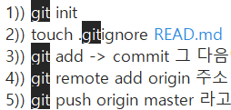
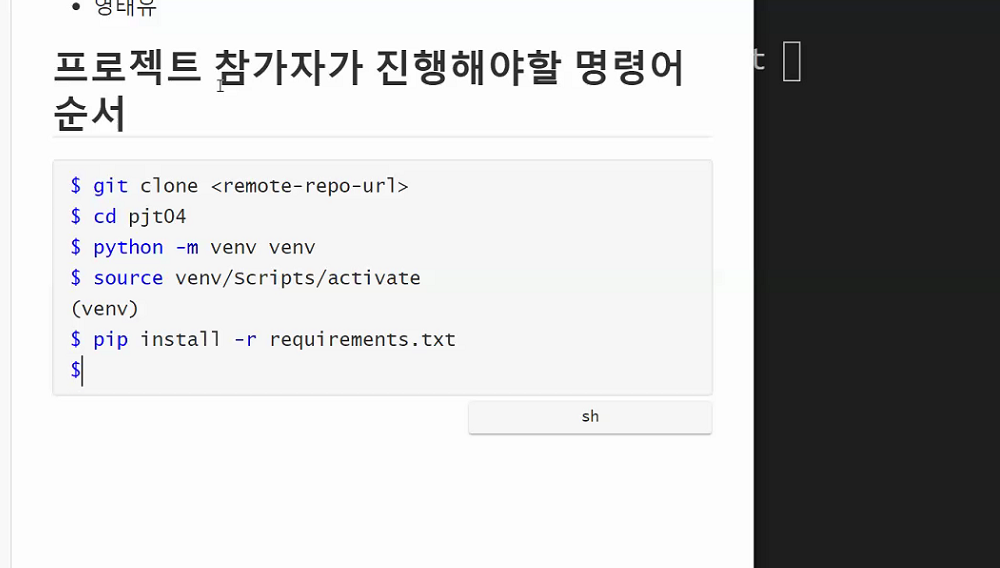

# git 사용하기

*2021.01.26*

1. 일단 가장 기본적으로 git에 push 할 때 , push 할 폴더에서 git bash 열어서

```
$ git add .
$ git commit -m '쓰고싶은말'
$ git push origin master
```

2. 조금 더 깊이 들어가서

```
$ git branch <branch-name> => 새로운 branch 생성
$ git switch(or checkout) branch-name => 전환
$ git switch -c <branch-name> => 새로운 branch 생성과 함께 전환 !! => add, push 하고 push origin 내브랜치이름 => lab에서 merge 
$ git branch -d <branch-name> => branch delete
$ git branch -D <branch-name> => 강제로 delete
$ git merge <branch-name> => branch 병합. ex)master과 home-page를 같은것으로 만들겠다.
```

3. 

```
$ git remote add github https://github.com/AmberPark/learn_git.git => github으로 푸쉬할때
$ git push github master
```


## git 리포 만들때

1.  `$ touch .gitignore`만들기
2.  `$ git init`
3.  `$ touch .gitignore READ.md`
4.  `$ git add .` -> `$ git commit` 그 다음에
5.  `$ git remote add origin 주소`
6.  ` $ git push origin master` 



## 받아올때

두번째 페어는 




1. `$ touch .gitignore`만들기 , vs code 들어가기

2. `$ git init`

3. python -m venv venv

4. source venv/Scripts/activete

5. pip install django django_extensions

6. pip freeze > requirements.txt (페어는 pip install -r requirements.txt 로 받아옴)

7. (`$ touch .gitignore READ.md` => 얘 1번에서 같이하기)

   

8. `$ git remote add origin 주소`(클론 눌러서 주소 복사한거)

9. git remote -v

10. `$ git add .` -> `$ git commit -m message` 

11. ` $ git push origin master` 


# git undo

- add 되돌리는거 => rm, 수정된 파일을 돌리는거는 restore
- commit 메세지 되돌리는거 => `git commit --ammend` => 다채로운 색깔의 vim 뜸 => `i` 누름(입력모드) => 끼워넣기 모드 됨 => 메세지 지우고 esc 눌러서 끼워넣기 모드 취소 => `:wq` 입력 하고 엔터. => git log로 확인. ( open vim, vim adventure 등의 사이트로 vim 연습할 수 잇음)

- 파일 하나 빠뜨리고 커밋 했을때도  `git commit --ammend`  => 커밋 파일 합쳐짐 => `:wq` 입력 하고 엔터.
- git log 간략하게 보려면 `git log --oneline`
- 과거로 돌아가고싶달 -> `git reset -- hard <가고자 하는 로그>` => 완전히 과거로 돌어가는거.(코드도 바뀜)
- `git reset --soft <가고자 하는 로그>` => 커밋의 시점은 과거로. add한 기록은 남겨두고.
- `git reset <가고자하는 로그>`(default 값이 --mixed) => add 전단계까지 남아있음. 


##  페어프로그래밍 git branch

1. 브랜치를 생성/이동한다. (`$ git switch -c <branch_name>`)
2. 이동한 브랜치에서 작업을 진행한다.
3. 주기적으로 커밋을 진행한다(N/D 모두 자유롭게 커밋 시점 이야기)
4. 차례가 끝나면, 최종 커밋 이후, `$ git push origin <branch_name>` 으로 PUSH
5. gitlab 에 가서 새로고침 이후, create merge request 를 진행
6. title 과 description 은 자유롭게 작성
7. assignee 도 자유롭게 지정
8. `remove source branch when merge request is accepted` 는 체크
9. submit merge request 버튼으로 요청 보내기
10. 생성된 merge request 는 다음사람이 병합해주기


model

```python
class UpcomingMovie(models.Model):
    title = models.CharField(max_length=100)
    poster_path = models.CharField(max_length=200)
    genre = models.TextField()
    overview = models.TextField()
    # original_language = models.CharField(max_length=50)
    release_date = models.CharField(max_length=50)
    # liked_users = models.ManyToManyField(settings.AUTH_USER_MODEL, related_name="liked_movies", blank=True)
    def __str__(self):
        return self.title
```

serializer

```python
class UpcomingMovieSerializer(serializers.ModelSerializer):
    class Meta:
        model = UpcomingMovie
        fields = '__all__'

class UpcomingMovieListSerializer(serializers.ModelSerializer):
    class Meta:
        model = UpcomingMovie
        fields = '__all__'
```


view

```python

@api_view(['GET'])
def upcoming_create(request):
    m_data={}
    results = []    
    for num in range(1, 20):
        up_url = f'http://api.themoviedb.org/3/movie/upcoming?api_key={api_key}&language=en-US&page={num}'
        res = requests.get(up_url) 
        movie = res.json()
        results.append(movie)   
    # m_data["results"] = results
    # print(results)
    # print(results[0].get('results')[0])
    all_movies = []
    movies = {}
    for n in range(20):
        try:
            movies["genre"] = results[n].get("results")[n].get("genre_ids")[0]
            movies["title"] = results[n].get("results")[n].get("title")
            movies["poster_path"] = results[n].get("results")[n].get("poster_path")
            movies["overview"] = results[n].get("results")[n].get("overview")
            movies["release_date"] = results[n].get("results")[n].get("release_date")
    
        
            all_movies.append(movies)
            # print(all_movies)
            serializers = UpcomingMovieListSerializer(data=movies)
            if serializers.is_valid(raise_exception=True):
                serializers.save()
                # print(serializers)
        
        except:
            pass
    
    return Response(serializers.data, status=status.HTTP_200_OK)
    # return HttpResponse("upcoming!!!")


@api_view(['GET'])
def upcoming_movies_list(request):
    upcoming_movies = UpcomingMovie.objects.all()
    serializers = UpcomingMovieListSerializer(upcoming_movies, many=True)
    return Response(serializers.data, status=status.HTTP_200_OK)
```

