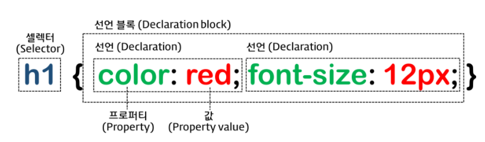

# CSS

HTML은 CSS를 포함할 수 있다. CSS를 가지고 있지 않은 HTML은 브라우저에서 기본으로 적용하는 CSS(user agent stylesheet)에 의해 렌더링된다.

## 선택자(selector)

스타일을 적용하고자 하는 HTML 요소를 선택

- 전체 설렉터

  - *: HTML 문서 내의 모든 요소를 선택한다. html 요소를 포함한 모든 요소가 선택된다. (head 요소도 포함된다)
- 태그 설렉터 
  - 태그명 : 지정된 태그명 가지는 요소 선택
- class 선택자

  - 클래스 선택자는 마침표 (.)문자로 시작. 해당 클래스가 적용된 문서의 모든 항목을 선택. 클래스 어드리뷰트값은 중복될 수 있음.
- id 선택자
	- #문자로 시작. 기본적으로 클래서 선택자와 같은 방식으로 사용
	- 그러나 id 는 문서당 한번만!!! 사용할 수 있음. 

## 프로퍼티(속성)

- {}내에 다양한 프로퍼티 지정. 연속 지정 가능하며 ; 로 구분.
- display property
  - block : block 특성을 가지는 요소(block 레벨 요소)로 지정 
    - 항상 새로운 라인에서 시작.
    - 화면 크기 전체의 가로폭 차지.
    - width, height, margin, padding 프로퍼티 지정 가능.
    - 블록 레벨 요수 내에 인라인 레벨 요소 포함 가능
  - inline : inline 특성을 가지는 요소(inline 레벨 요소)로 지정
    - 새로운 라인에서 시작하지 않으며 문장의 중간에 들어갈 수 있다. 즉, 줄을 바꾸지 않고 다른 요소와 함께 한 행에 위치한다.
    - content의 너비만큼 가로폭을 차지한다.
    - **width, height, margin-top, margin-bottom 프로퍼티를 지정할 수 없다.** 상, 하 여백은 line-height로 지정한다.
    - inline 레벨 요소 뒤에 공백(엔터, 스페이스 등)이 있는 경우, 정의하지 않은 space(4px)가 자동 지정된다.
    - inline 레벨 요소 내에 block 레벨 요소를 포함할 수 없다. inline 레벨 요소는 일반적으로 block 레벨 요소에 포함되어 사용된다.
  - inline-block : inline-block 특성을 가지는 요소(inline-block 레벨 요소)로 지정
    - 기본적으로 inline 레벨 요소와 흡사하게 줄을 바꾸지 않고 다른 요소와 함께 한 행에 위치시킬 수 있다.
    - block 레벨 요소처럼 width, height, margin, padding 프로퍼티를 모두 정의할 수 있다. 상, 하 여백을 margin과 line-height 두가지 프로퍼티 모두를 통해 제어할 수 있다.
    - content의 너비만큼 가로폭을 차지한다.
  - none : 해당 요소를 화면에 표시하지 않는다 (공간조차 사라진다)

